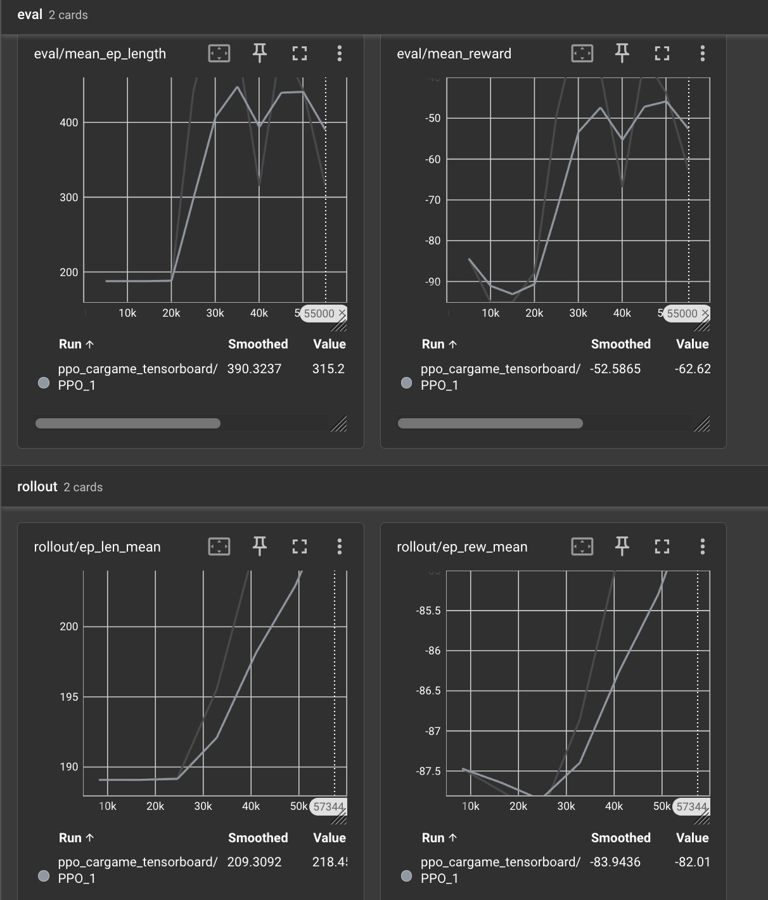

# Car game gym [Web app](https://jonathancoletti.github.io/CarDodgingGym/)
A reinforcement learning environment for car dodging using gymnasium, pygame, python, onnx runtime


# How to run

## Files

You must add 
`car_game/assets/cars/car.png` 
`car_game/assets/cars/otherCar.png`
`car_game/assets/fonts/joystix monospace.otf`

## Install deps

```
pip install -e .
```

## Training
NOTE: make sure to not run on a CUDA device as it is slower
```
python3 car_game/run.py train
```

## What I used to train

```
export CUDA_VISIBLE_DEVICES= && python car_game/run.py train --timesteps 4500000     --n_envs 64     --n_steps 2048     --learning_rate 0.00003     --n_epochs 4     --ent_coef 0.001
```

## Running

```
python3 car_game/run.py play 
```

## Exporting

```
python3 car_game/export_onnx.py
```

## Tensorboard

```
tensorboard --logdir car_game/logs
```

# Zipping 4 training 

```
zip -r project.zip . -x "*.zip" "venv/*" "venv_*/*"
```

<<<<<<< HEAD
=======

>>>>>>> fe0c014 (Train 4M timestep, add tensorboard data and update README)
# Results
TODO: I have not finished a proper train with good results





# Write up stuff


```
pip install copier
```

```
copier copy https://github.com/Farama-Foundation/gymnasium-env-template.git "./"
No git tags found in template; using HEAD as ref
🎤 The name of your Gymnasium environment
   car_game
🎤 The license for your Gymnasium environment
   MIT

Copying from template version 0.0.0.post33.dev0+052456f
    create  .pre-commit-config.yaml
  conflict  README.md
?  Overwrite README.md? No
    create  LICENSE
    create  .gitignore
    create  car_game
    create  car_game/wrappers
    create  car_game/wrappers/relative_position.py
    create  car_game/wrappers/reacher_weighted_reward.py
    create  car_game/wrappers/discrete_actions.py
    create  car_game/wrappers/__init__.py
    create  car_game/wrappers/clip_reward.py
    create  car_game/__init__.py
    create  car_game/envs
    create  car_game/envs/grid_world.py
    create  car_game/envs/__init__.py
    create  pyproject.toml
```


```
pip3 install stable_baselines3
```

```
pip3 install tensorboard 
```


```
pip install 'stable-baselines3[extra]'
```


```
pip install onnx onnxruntime onnxscript
```

```
zip -r -x "venv/*" -X ./car_game_gym.zip .
```

```
python3 run.py train --n_envs 10 --timesteps 100000
```


python3 train.py train


## Problems

### Reward hacking
